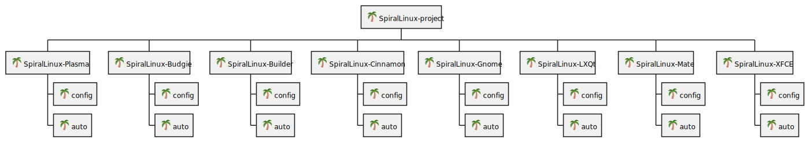
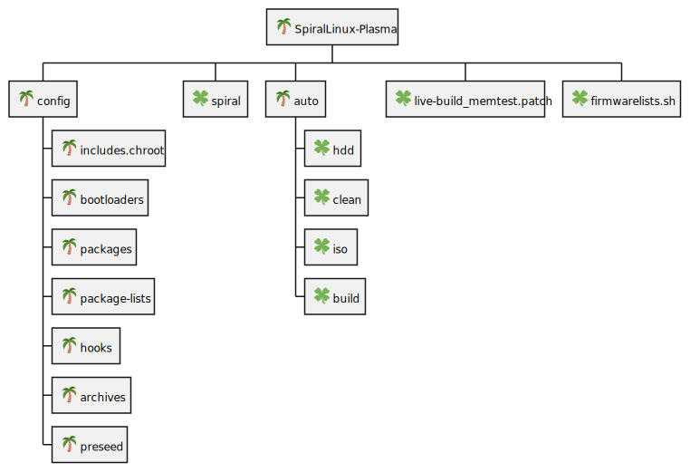
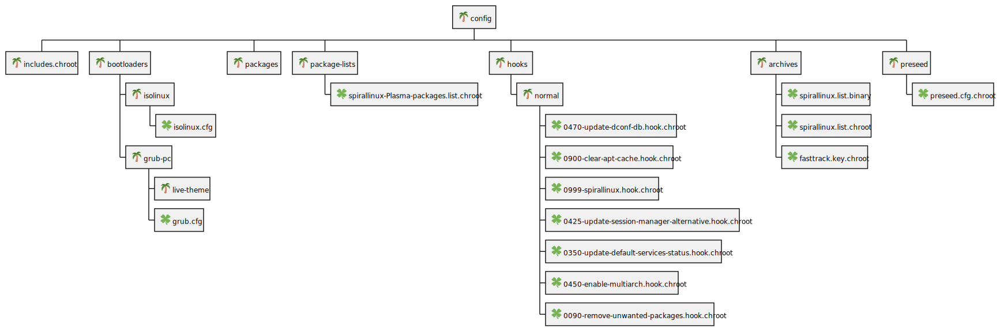
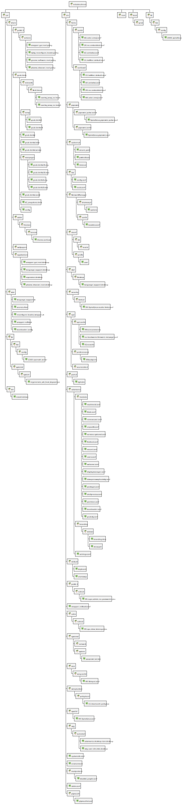

# Overview

After learning about [SpiralLinux](https://spirallinux.github.io/), I've been curious about the structure and internals of the project.  The [github repository](https://github.com/SpiralLinux/SpiralLinux-project) has a bunch of tarballs which didn't really explain much to me.  So I cloned the repository, and unpacked the different tarballs, then examined the folder structure.

I will be looking more into the structure and documenting stuff as I go along, and I'll also be reading up on the [SpiralLinux Wiki](https://github.com/SpiralLinux/SpiralLinux-project/wiki), but I wanted to get some incremental documentation in place for both my benefit, as well as anyone else who might be curious.  Hopefully this is useful to people besides me.

## Current Status

- [X] Generated basic folder structure overview in plantuml
- [ ] Deeper dive/annotation of folders/files
- [ ] Understanding of automatic build process

## Folder Structure Overview

I'll be showing incrementally zoomed in pictures of the folder structure - later, I anticipate updating the plantuml diagrams with more annotations, but for now, here's the basic pictures I created using my [folder to plantuml wbs python script](https://github.com/prajjwald/utils/blob/main/python/folder_to_wbs_puml.py).

### Top level

The top level is pretty much a view of all the different tarballs I untarred, with two levels of depth shown.

I see that each folder structure is pretty identical - whether it is Plasma, Gnome, LXQT, etc., there is a `config` directory and an `auto` directory.  Let's dive deeper.

### Zoom in to Plasma Tree

I see there is a config tree, a spiral folder, an auto folder which presumably contains details about how to kick off the build (automated), and some helper files.  Let's dive into the config section next.

### Zoom in to Plasma/Config Subtree

The config subtree is very rich - it seems to have a `chroot` section, which might be used for copying over files into the install root, a `bootloaders` section, presumably for some bootloader tweaking, `package-lists`, which may be for additional repositories, `hooks` - will have to look into this later, `archives` - TBD, and `preseed` - TBD.

As the `chroot` section seems interesting, let's do a deeper dive into that section

### Zoom into the chroot section

As the name suggessts, the chroot section seems to have a mini-tree for different files that might be copied over to the install - that's my guess as of now.

